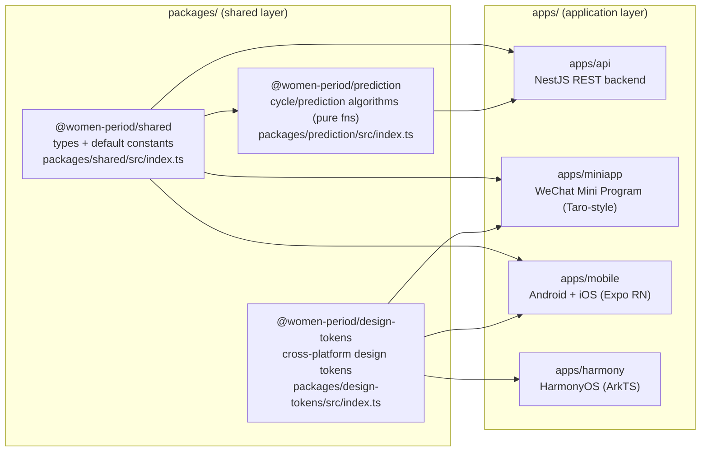
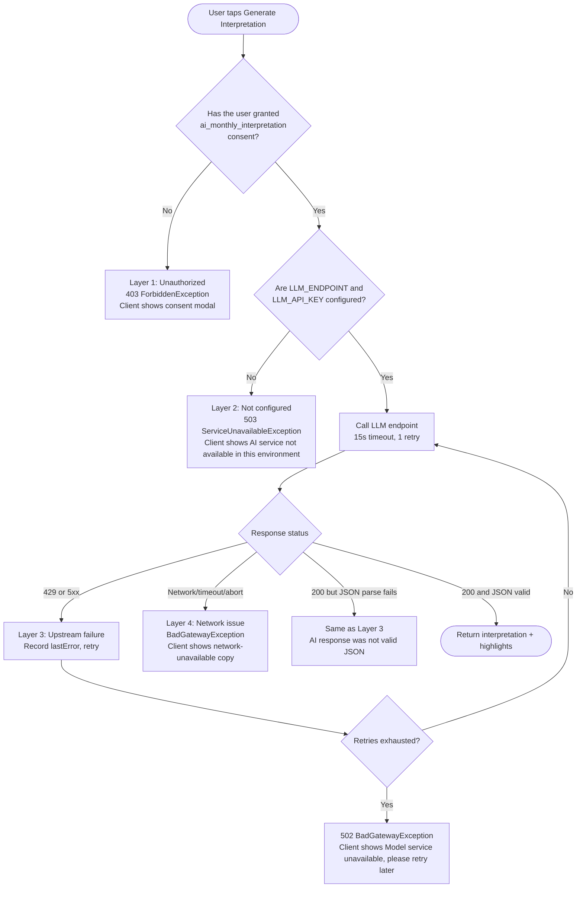

# Lune · A Multi-Platform AI Health Product That Hands Period Data Back to Its Owner

> English | [简体中文](./README.md)

> A 20-year-old solo student developer shipped one AI health product to **4 platforms** (WeChat Mini Program / Android / iOS / HarmonyOS) — architecture, cross-platform core algorithms, LLM integration, and production deployment all done single-handedly.

     

<!-- TODO(author to fill in): Hero shot — the same screen rendered side-by-side on WeChat Mini Program / Android / iOS / HarmonyOS -->
<!--  -->

---

## The Problem It Solves

Period-tracking apps are practically a smartphone staple by now, yet the market has long ignored two real problems:

**1. Fragmented experience.** Users on WeChat, Android, iOS, and HarmonyOS are split across four mutually incompatible products. Switching devices means data migration and starting setup from scratch.

**2. Ambiguous data posture.** Cycle dates, symptoms, moods, relationship notes — this is some of the most sensitive health data a person produces. Yet most apps in the category quietly upload it to the cloud, feed it into training pipelines, or fold it into marketing profiles. "We protect your privacy" is a link in a Privacy Policy footer, not an architectural decision.

**Lune's answer:**

- One shared core, four native UIs: algorithms and business logic stay consistent across platforms; each UI follows the muscle memory of its own platform.
- **Data is local-first by default, AI calls are sanitized by default, sensitive consent is a separate primitive by default** — not checkboxes on a compliance list, but defaults baked into the code.
- AI monthly interpretation is bounded as "pattern summary," never "medical conclusion" — enforced via hard constraints in the prompt, JSON Schema validation, and explicit downgrade paths on upstream failure. It will not "confidently say the wrong thing."

---

## Core Features

| Feature | Description |
|---|---|
| **Four native experiences** | WeChat Mini Program / Android / iOS / HarmonyOS — each UI is platform-native, core algorithms live in shared packages. |
| **Adaptive cycle prediction** | When sample size is small, confidence is actively lowered; when records are stable, a tight prediction window is shown. No false confidence. |
| **AI monthly pattern interpretation** | Connects to OpenAI-compatible endpoints (DeepSeek / Doubao etc.) with strict JSON structure and sanitized statistics. Four error classes — unauthorized / unconfigured / upstream failure / network timeout — are routed separately. |
| **Privacy-first architecture** | Sensitive health consent (`sensitive_health_data`) and AI-call consent (`ai_monthly_interpretation`) are independent types in the data model. Export and deletion are first-class features. |

<!-- TODO(author to fill in): Animated GIF of the cycle prediction main screen -->
<!--  -->

<!-- TODO(author to fill in): Animated GIF of the AI monthly interpretation feature -->
<!--  -->

---

## Technical Architecture

```
┌─────────────────┐   ┌─────────────────┐   ┌─────────────────┐   ┌─────────────────┐
│  miniapp        │   │  mobile         │   │  mobile         │   │  harmony        │
│  (WeChat MP)    │   │  (Android, RN)  │   │  (iOS, RN)      │   │  (HarmonyOS)    │
└────────┬────────┘   └────────┬────────┘   └────────┬────────┘   └────────┬────────┘
         │                     │                     │                     │
         │            HTTP (x-user-id header)        │                     │
         └─────────────────────┼─────────────────────┴─────────────────────┘
                               │
                ┌──────────────▼──────────────┐
                │   apps/api (NestJS)         │
                │   /cycles  /reminders       │
                │   /consents  /privacy       │
                │   /cycles/ai-interpretation │
                └──────────────┬──────────────┘
                               │
        ┌──────────────────────┼──────────────────────┐
        │                      │                      │
   @women-period/shared  @women-period/prediction  @women-period/design-tokens
   (types + defaults)    (pure cycle/prediction fns) (cross-platform tokens)
```

- **Shared layer**: 3 npm packages — types, algorithms, and design tokens shared across all 4 platforms.
- **Application layer**: 4 client apps + 1 API service, each deployed and built independently.
- **Data flow**: Every platform talks to the same set of REST endpoints. Business rules are expressed exactly once, on the NestJS server.

---

## Technical Highlights

> This section is the heart of the README. Of the four highlights below, **Highlight 1 (Monorepo architecture)** and **Highlight 2 (LLM error-tiered degradation)** are the co-leads.

### Highlight 1: Cross-Platform Monorepo with Yarn Workspaces

#### The core problem

Four platforms, four UI stacks (Taro / Expo-RN / Expo-RN / ArkTS), but **business rules, data contracts, and the cycle prediction algorithm must agree across all four**. Writing them four times leads to an incident on the very first requirement change — "Android predicts 28 days, HarmonyOS predicts 30 days." Going the opposite way and picking one universal framework (Flutter / Taro-everywhere / React Native Web) demotes at least one platform's experience to second class.

#### The trade-off this project makes

> **Share the algorithms and contracts. Do not share the UI framework.**

- **Shared**: type definitions, default constants, pure-function algorithms, design tokens. These are the parts that *must* produce identical answers on every platform.
- **Not shared**: the UI framework. Each platform uses whatever it does best — WXML/WXSS on the Mini Program, React Native (Expo) on mobile, ArkTS on HarmonyOS — so that performance and interaction feel match what users expect on each platform.

The implication: in a cross-platform project, the goal of "reuse" is not to maximize lines of code reused but to **minimize decision points**. Any single judgment call like "what do we do when a period runs longer than 5 days?" has exactly one place in the codebase where it can be made.

#### Package layout (actual repository)

Code reference: [`package.json:5-8`](./package.json)



#### A few details that prove the architecture actually landed

| Observation | Evidence |
|---|---|
| All platforms reference the same `CycleRecord` type | [`packages/shared/src/index.ts:44`](./packages/shared/src/index.ts) — the `CycleRecord` interface; server, miniapp, and mobile all import it from here |
| The cycle algorithm is one implementation for all four platforms | [`packages/prediction/src/index.ts:69`](./packages/prediction/src/index.ts) — `buildPredictionSnapshot`; the NestJS server calls it directly via `@women-period/prediction` |
| Design tokens compile to each platform's native format | `packages/design-tokens/scripts/emit-wxss.mjs` emits WXSS variables for the Mini Program; `emit-harmony.mjs` emits HarmonyOS resources |
| HarmonyOS cannot consume TS packages from ArkTS, so types are re-declared in ets | [`apps/harmony/entry/src/main/ets/common/Types.ets`](./apps/harmony/entry/src/main/ets/common/Types.ets) — a concrete example of "giving up reuse to respect a platform's constraints" |
| Root scripts enforce dependency-ordered builds | [`package.json:10`](./package.json) — `build = design-tokens → shared → prediction → api → miniapp → mobile` |

---

### Highlight 2: A Four-Tier LLM Error Degradation Pipeline

#### The core problem

OpenAI-compatible LLM endpoints like DeepSeek and Doubao **will fail in production** — guaranteed: 429 rate limits, 500s, network timeouts, malformed JSON output, missing API key, missing user consent. Sweeping all of that into one `try/catch` and showing "something went wrong" leaves users unable to decide whether to retry or give up, and leaves developers unable to tell whether the issue is upstream or in their own configuration.

#### How this project tiers errors

> **Tier errors by who owns the decision, not by HTTP status code.**



The boundaries of the four layers correspond to four **different user decisions**:

| Layer | Source of error | Client copy | What the user should do |
|---|---|---|---|
| **Layer 1: Unauthorized** | User hasn't granted AI consent | "Enable AI interpretation" modal | Read the terms and accept / cancel |
| **Layer 2: Unconfigured** | Server env has no LLM hookup | "AI service not configured in this environment" | Do not retry (this environment simply doesn't have it) |
| **Layer 3: Upstream failure** | Model returns 429 / 5xx / malformed JSON | "Model service unavailable, please retry later" | Wait and retry |
| **Layer 4: Network timeout** | abort / connect failure | "Network unreachable" | Check connectivity and retry |

#### Code that proves the tiering actually exists

| Layer | Server-side evidence | Client-side evidence |
|---|---|---|
| Layer 1 (consent gate) | [`apps/api/src/modules/ai/ai-interpretation.service.ts:77`](./apps/api/src/modules/ai/ai-interpretation.service.ts) — `assertConsent` throws `ForbiddenException` | [`apps/miniapp/src/pages/insights/index.ts:388`](./apps/miniapp/src/pages/insights/index.ts) — `ensureAIConsent` shows the modal |
| Layer 2 (not configured) | [`apps/api/src/modules/ai/ai-interpretation.service.ts:53`](./apps/api/src/modules/ai/ai-interpretation.service.ts) — `ServiceUnavailableException(503)`; also warned on boot at [`apps/api/src/main.ts:17`](./apps/api/src/main.ts) | [`apps/miniapp/src/pages/insights/index.ts:379`](./apps/miniapp/src/pages/insights/index.ts) — on `statusCode === 503`, shows "AI not configured" |
| Layer 3 (upstream + retry) | [`apps/api/src/modules/ai/ai-interpretation.service.ts:167-209`](./apps/api/src/modules/ai/ai-interpretation.service.ts) — `for` loop with `MAX_RETRIES=1`, retries on `status === 429 \|\| status >= 500`; JSON parse failures land here too | [`apps/miniapp/src/pages/insights/index.ts:381`](./apps/miniapp/src/pages/insights/index.ts) — on `statusCode === 502`, shows "Model service unavailable" |
| Layer 4 (network) | `AbortController` + 15s timeout, [`ai-interpretation.service.ts:26`](./apps/api/src/modules/ai/ai-interpretation.service.ts) | [`apps/miniapp/src/services/api.ts:64-87`](./apps/miniapp/src/services/api.ts) — `wx.request` fail callback classifies `request:fail/ECONNREFUSED/timeout` as `kind:"network"` |

#### Hard constraints in the prompt (also part of LLM fault tolerance)

The Chinese system prompt at [`apps/api/src/modules/ai/prompt-templates.ts:12-19`](./apps/api/src/modules/ai/prompt-templates.ts) carries three constraints at once:

1. **Content boundaries**: no diagnoses, no medication recommendations, no pregnancy judgments — the product/legal boundary.
2. **Structural constraints**: must return strict JSON `{"interpretation": ..., "highlights": [...]}` with the explicit rule "no extra text, no Markdown fences."
3. **Fallback wording for insufficient data**: when `cycleCount < 2`, output must start with "records aren't enough yet" — a semantic guardrail aligned with the algorithm-layer `status: "insufficient_data"`.

After receiving the response, the server **validates it again**: strip Markdown fences → `JSON.parse` → field-type checks ([`ai-interpretation.service.ts:212-240`](./apps/api/src/modules/ai/ai-interpretation.service.ts)). Failure at any of the three steps drops into Layer 3. This "don't trust the LLM output" layer treats the LLM as **an untrusted external service**, not an "AI friend."

#### Data points (author to verify)

- DeepSeek monthly-interpretation mean response latency **484ms** (author-quoted, not re-verified here, pending calibration)
- `temperature: 0.4` + `response_format: { type: "json_object" }` ([`ai-interpretation.service.ts:163-165`](./apps/api/src/modules/ai/ai-interpretation.service.ts))

---

### Highlight 3: Cycle Prediction with Adaptive Confidence

#### The problem

When a new user has logged just one cycle, predicting her next start date is essentially a guess. When a long-time user has logged 8 cycles and is highly regular, the prediction can be confident. **"How sure am I?" must look different to the user in these two cases** — otherwise users get misled by misplaced confidence.

#### The implementation

The core logic of `buildPredictionSnapshot` at [`packages/prediction/src/index.ts:69-103`](./packages/prediction/src/index.ts):

```ts
const variability = Math.round(variance(cycleLengths));
const windowRadius = Math.max(2, Math.min(5, variability || 2));
const status =
  sorted.length < 2 ? "insufficient_data"
  : variability <= 2 ? "stable"
  : "estimated";
const confidence =
  sorted.length < 2 ? 0.45
  : variability <= 2 ? 0.84
  : 0.62;
```

Three-tier adaptive output:

| Sample / variance | status | confidence | window radius | Meaning |
|---|---|---|---|---|
| Records < 2 | `insufficient_data` | 0.45 | 2 days | "I'm not sure — fall back to the default 28 days" |
| Variance ≤ 2 | `stable` | 0.84 | 2 days | "Your cycle is very regular — the window can be tight" |
| Variance > 2 | `estimated` | 0.62 | up to 5 days | "Your cycle fluctuates — here's a wider possible range" |

The "window automatically widens when variability is high" design is the most-overlooked piece of engineering empathy in prediction algorithms: **users with irregular cycles should not be served false precision**.

#### Engineering guarantees

- **Pure functions**: [`packages/prediction/src/index.ts`](./packages/prediction/src/index.ts) has no I/O and no stray `Date.now()` calls (except a single `generatedAt`). Identical inputs produce identical outputs on every platform.
- **Vitest unit tests**: [`packages/prediction/src/index.spec.ts`](./packages/prediction/src/index.spec.ts) covers "single record falls back to default", "stable mode emits stable status", and "irregular mode yields confidence < 0.8 and status = estimated". Run with `npm run test:prediction`.
- **Cross-platform consistency**: both [`apps/api/src/modules/cycle/cycle.service.ts`](./apps/api/src/modules/cycle/cycle.service.ts) and [`privacy.service.ts:26`](./apps/api/src/modules/privacy/privacy.service.ts) reuse the function directly via `import { buildPredictionSnapshot } from "@women-period/prediction"` — guaranteeing that the prediction shown in an exported data file is the exact same prediction the user sees in-app.

> Because ArkTS cannot consume npm packages directly, the HarmonyOS client currently **depends on the server-returned `PredictionSnapshot`** rather than computing locally. This is a deliberate trade-off — see the `Types.ets` note in Highlight 1.

---

### Highlight 4: Treating Privacy as an Architectural Decision

> This section deliberately doesn't enumerate "the compliance items we ticked off." A compliance checklist is a patch. **An architectural decision is a stance.**

#### Decision 1: Data stays local by default; the cloud only enters when the user actively opts in

- The onboarding copy isn't marketing language — it's a commitment: **"Your period data stays only with you"**, **"No signup · Data lives locally"** ([`apps/miniapp/src/pages/onboarding/index.ts:60-69`](./apps/miniapp/src/pages/onboarding/index.ts); the same copy is on mobile at [`apps/mobile/app/onboarding.tsx:28-46`](./apps/mobile/app/onboarding.tsx); HarmonyOS uses [`OnboardingStorage.ets`](./apps/harmony/entry/src/main/ets/common/OnboardingStorage.ets) with `dataPreferences` to keep onboarding state on-device).
- **Why is the default local?** Because no user actually reads a full privacy policy on first launch. If the default is "upload to the cloud," then "I don't know" gets translated into "I agree." Putting the default at local means we accept more engineering complexity (sync, export, cross-platform backup) — and in exchange, users are protected when they're silent.

#### Decision 2: Fields sent to AI go through a strict allow-list sanitizer, not a deny-list

- Implemented in `buildSanitizedPayload` at [`apps/api/src/modules/ai/ai-interpretation.service.ts:94-123`](./apps/api/src/modules/ai/ai-interpretation.service.ts). The inline comment is blunt: "Strict allow-list sanitizer. Anything not explicitly listed below must NOT leave this process."
- **The allow-list contains**: `cycleCount`, `averageCycleLength`, `averagePeriodLength`, `cycleVariability`, `flowDistribution`, `topSymptoms` (top 3), `topMoods` (top 2), `predictionStatus`, `language`.
- **It does not contain**: `userId`, raw `note` text (free-form relationship/mood text the user wrote), exact dates, `createdAt`/`updatedAt`, device info.
- **Why an allow-list?** A deny-list forces you to remember "could this new field leak something private?" every single time you add one. An allow-list is **closed by default — adding a field requires a deliberate decision**. That changes "we forgot a field" from a normal failure mode into one that has to be intentional.
- Before the call, the client also shows the user **field-by-field** what data will be sent ([`apps/miniapp/src/pages/insights/index.ts:14-16`](./apps/miniapp/src/pages/insights/index.ts) — the `AI_CONSENT_PURPOSE` constant). This is up-front disclosure, not after-the-fact notification.

#### Decision 3: Health-data consent is split out as its own type, not folded into general consent

- In the `ConsentType` union at [`packages/shared/src/index.ts:13-18`](./packages/shared/src/index.ts), `sensitive_health_data` and `ai_monthly_interpretation` sit alongside `privacy_policy` and `notifications` as **four peer types** — not as sub-items of `privacy_policy`.
- **Why split them?** Because their revocation semantics are different:
  - Revoking `privacy_policy` ≈ deleting your account.
  - Revoking `sensitive_health_data` ≈ "I still want to use the app, but stop letting me log symptoms."
  - Revoking `ai_monthly_interpretation` ≈ "I still want to log data, but don't send the statistics to an LLM anymore."
- Putting them in the same `ConsentRecord` table with independent grant/withdraw flows ([`apps/api/src/modules/consent/consent.service.ts:50-66`](./apps/api/src/modules/consent/consent.service.ts)) lets the user say precisely "I agree to this, not to that" — instead of being forced into "all or nothing."

#### Decision 4: Export and delete are first-class features, not buried three levels deep in Settings

- `exportData` at [`apps/api/src/modules/privacy/privacy.service.ts:17-45`](./apps/api/src/modules/privacy/privacy.service.ts) returns **everything** in one call (cycles / reminders / consents / privacyActions / telemetry / a freshly computed prediction), and writes the export action itself into the audit log (`PrivacyActionType: "export_data"`).
- `deleteAccount` is not a soft delete: [`privacy.service.ts:36-45`](./apps/api/src/modules/privacy/privacy.service.ts) calls `this.store.deleteUser(userId)` directly and clears every Map.
- **Design philosophy**: the better export and delete are, the **more likely users are to choose to stay** — because they know they can leave at any time. Making the exit door big is how you ensure the people who stay are doing so by choice.

---

## Project Structure

```
women_period/
├── packages/                          # Cross-platform shared layer (npm packages)
│   ├── shared/                        # Types + default constants (DEFAULT_CYCLE_LENGTH, etc.)
│   ├── prediction/                    # Cycle/prediction algorithms + Vitest tests
│   └── design-tokens/                 # Design tokens + WXSS/HarmonyOS emitters
│
├── apps/                              # Application layer (each independently deployable)
│   ├── api/                           # NestJS REST backend (in-memory store)
│   │   └── src/modules/
│   │       ├── ai/                    # LLM integration + 4-layer error degradation
│   │       ├── cycle/                 # Cycle CRUD + dashboard aggregation
│   │       ├── consent/               # Fine-grained consent management
│   │       └── privacy/               # Export / delete / audit
│   ├── miniapp/                       # WeChat Mini Program (native WXML + TS)
│   ├── mobile/                        # Android + iOS (Expo Router + RN)
│   └── harmony/                       # HarmonyOS (ArkTS / ets)
│
├── scripts/                           # Cross-platform build / packaging scripts (PowerShell + CommonJS)
└── package.json                       # Yarn Workspaces root
```

## Local Development

> Requires Node >= 20, npm >= 10.

```bash
# Install dependencies (one shot — all four platforms + shared packages)
npm install

# Build shared packages (mobile / miniapp / api all depend on this step)
npm run build:shared && npm run build:prediction && npm run build:design-tokens

# Start the NestJS API
npm run dev:api
# → http://localhost:3000

# Run the WeChat Mini Program (import apps/miniapp into WeChat DevTools)
npm run build:miniapp
npm run open:miniapp

# Run mobile (Expo)
npm run start:mobile          # dev server
npm run start:mobile:android  # straight to Android
npm run start:mobile:ios      # straight to iOS

# Run HarmonyOS (install DevEco Studio first)
npm run check:harmony-env
npm run build:harmony

# Run algorithm unit tests
npm run test:prediction
```

To get AI interpretation running, set `LLM_ENDPOINT` and `LLM_API_KEY` in the `apps/api` environment (any OpenAI-compatible endpoint works, e.g. DeepSeek or Doubao). When unset, `/cycles/ai-interpretation` deliberately returns **503** and the client degrades to Layer 2 copy — this is designed behavior, not a bug.
