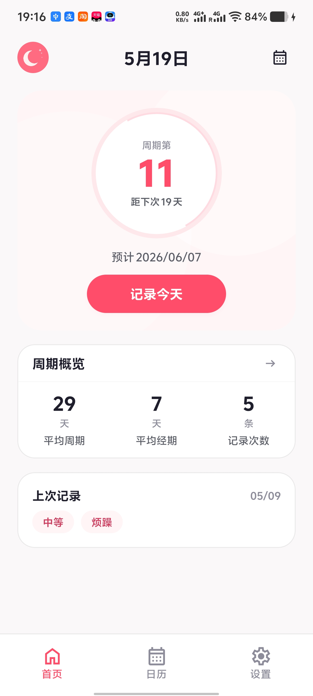
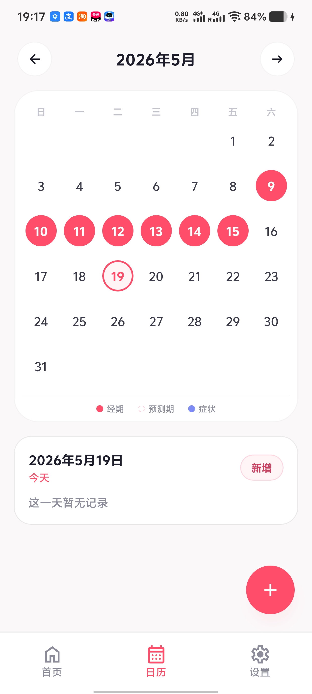
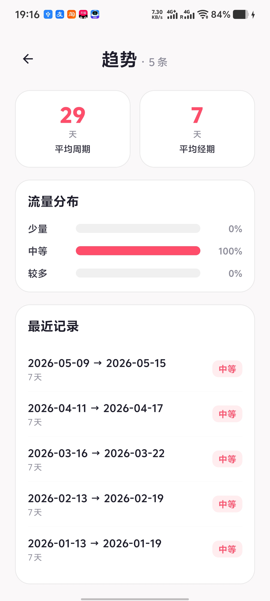
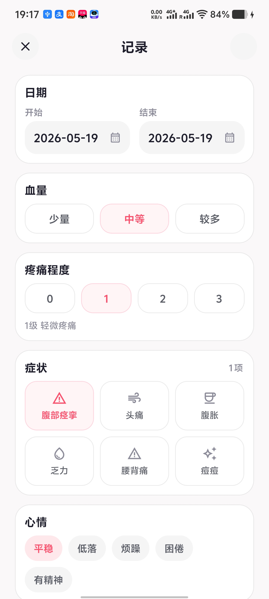
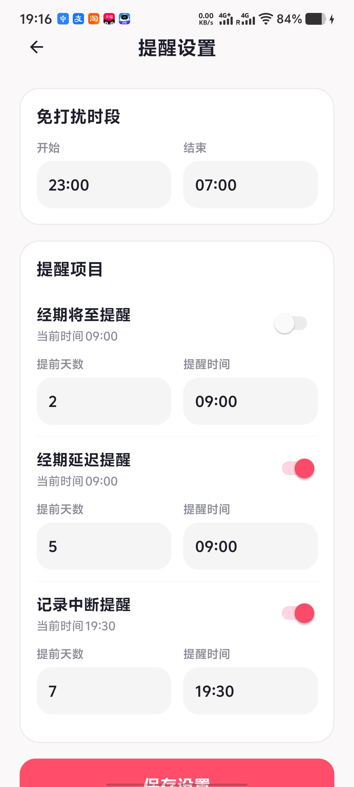
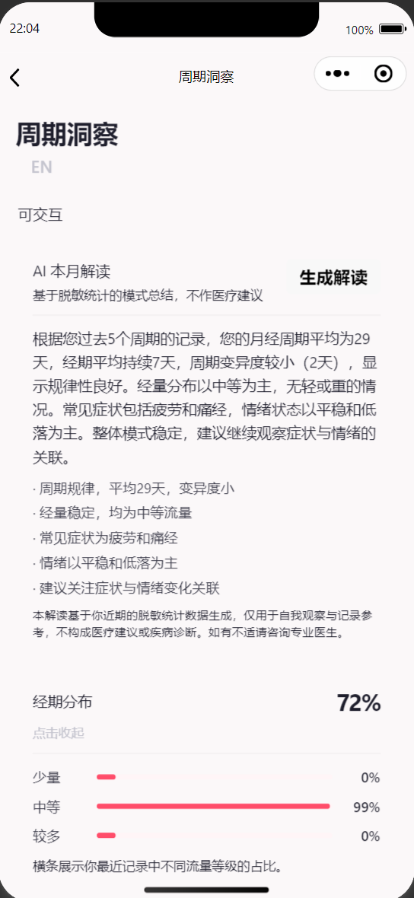
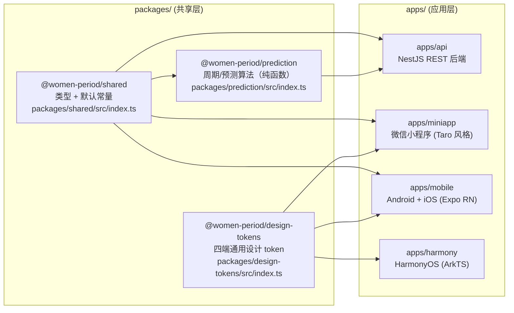
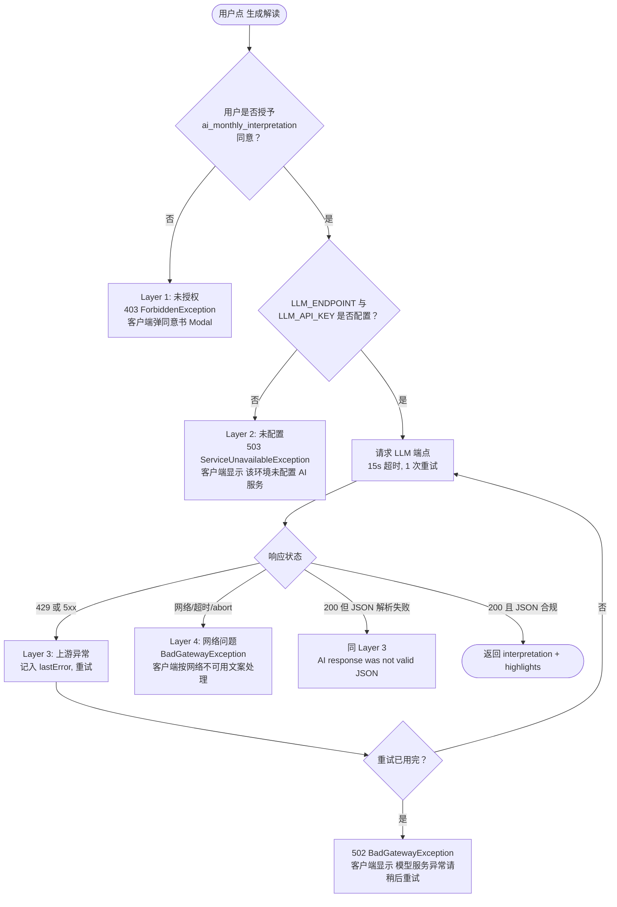
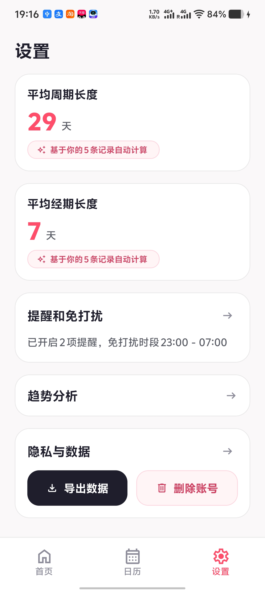

# Lune · 把经期数据交还给用户的多端 AI 健康产品

> [English](./README.en.md) | 简体中文

> 一位 20 岁在校独立开发者，把一个 AI 健康产品做到了 **4 个平台**（微信小程序 / Android / iOS / 鸿蒙），从架构、跨端核心算法、LLM 集成到部署上线一人完成。

     



> 截图取自 Android 端；微信小程序 / iOS / 鸿蒙端 UI 各自原生迭代，截图后续补。

---

## 它解决什么问题

经期跟踪类 App 几乎已经是手机标配，但它存在两个被市场长期忽略的问题：

**1. 体验割裂。** 微信生态、安卓、iOS、鸿蒙的用户被四套互不相通的产品瓜分，跨端切换设备就意味着数据迁移和重新设置。

**2. 数据立场暧昧。** 经期、症状、情绪、伴侣关系——这是用户最敏感的健康记录。但绝大多数同类产品默认把它们上云、用于训练或营销画像，"我们承诺保护你的隐私"只是一行 Privacy Policy 链接，而不是一个架构决策。

**Lune 想给的答案：**

- 一套核心 + 四端原生 UI：算法和业务逻辑跨端一致，UI 各自符合各端用户的肌肉记忆。
- **数据默认本地、AI 默认脱敏、敏感同意默认独立**——不是合规清单上的勾选项，是写在代码里的默认值。
- AI 月度解读以"模式总结"而非"医疗结论"为界——Prompt 里硬约束、JSON Schema 校验、上游失败显式降级，不会"自信地说错"。

---

## 核心特性

| 特性 | 说明 |
|---|---|
| **四端原生体验** | 微信小程序 / Android / iOS / 鸿蒙，UI 各端原生，核心算法走共享 package。 |
| **自适应周期预测** | 样本不足时主动降低 confidence，样本稳定时给出明确预测窗口；不会"假装很自信"。 |
| **AI 本月模式解读** | DeepSeek/Doubao 等 OpenAI-兼容端点接入，严格 JSON 结构 + 脱敏统计，未授权 / 未配置 / 上游异常 / 网络超时四类错误分流。 |
| **隐私优先架构** | 健康数据敏感同意 (`sensitive_health_data`) 与 AI 调用同意 (`ai_monthly_interpretation`) 在数据模型上就是独立类型；导出/删除是一等公民功能。 |

| 日历 · 经期标记 + 今日定位 | 趋势 · 流量分布 + 最近 5 次记录 | 记录 · 血量/疼痛/症状/心情 | 提醒 · 免打扰 + 三类提醒 |
|:---:|:---:|:---:|:---:|
|  |  |  |  |

**AI 月度解读** v1 仅微信小程序端有 UI 入口（亮点 2 详述完整 prompt 与 4 层错误降级流程）：



---

## 技术架构

```
┌─────────────────┐   ┌─────────────────┐   ┌─────────────────┐   ┌─────────────────┐
│  miniapp        │   │  mobile         │   │  mobile         │   │  harmony        │
│  (微信小程序)    │   │  (Android, RN)  │   │  (iOS, RN)      │   │  (鸿蒙, ArkTS)  │
└────────┬────────┘   └────────┬────────┘   └────────┬────────┘   └────────┬────────┘
         │                     │                     │                     │
         │            HTTP (x-user-id header)        │                     │
         └─────────────────────┼─────────────────────┴─────────────────────┘
                               │
                ┌──────────────▼──────────────┐
                │   apps/api (NestJS)         │
                │   /cycles  /reminders       │
                │   /consents  /privacy       │
                │   /cycles/ai-interpretation │
                └──────────────┬──────────────┘
                               │
        ┌──────────────────────┼──────────────────────┐
        │                      │                      │
   @women-period/shared  @women-period/prediction  @women-period/design-tokens
   （类型 + 默认常量）    （周期/预测纯函数）        （4 端通用设计 token）
```

- **共享层**：3 个 npm package，跨 4 端共用类型、算法、设计 token。
- **应用层**：4 个端 + 1 个 API 服务，互相独立部署、独立构建。
- **数据流**：所有端走同一组 REST 端点，业务规则在 NestJS 服务端表达一次。

---

## 技术亮点

> 这一节是这份 README 的主体。下面 4 个亮点中，**亮点 1（Monorepo 架构）** 和 **亮点 2（LLM 错误分层降级）** 是双主角。

### 亮点 1：Yarn Workspaces 跨端 Monorepo 架构

#### 核心问题

4 个端、4 套 UI 技术栈（Taro / Expo-RN / Expo-RN / ArkTS），但**业务规则、数据契约、周期预测算法必须四端一致**。如果在每个端各写一份，第一次需求变更就会出现"安卓预测出 28 天、鸿蒙预测出 30 天"的事故；如果选一个统一框架（Flutter / Taro 全量、React Native Web），又会让某个端的体验降到二等公民。

#### 这个项目的取舍

> **共享算法和契约，不共享 UI 框架。**

- **共享**的是：类型定义、默认常量、纯函数算法、设计 token。这些是"四端必须答案一致"的部分。
- **不共享**的是：UI 框架。每个端用各自最擅长的方式——小程序用 WXML/WXSS、移动端用 React Native (Expo)、鸿蒙用 ArkTS——确保每端的性能与交互手感是该平台用户期望的。

这个取舍意味着：跨端项目的"复用"目标不是"代码行数最大化"，而是"**决策点最小化**"——任何一次"周期超过 5 天怎么算"的判断，全项目只能在一个地方做。

#### 包结构（实际仓库）

代码引用：[`package.json:5-8`](./package.json)



#### 几个能证明这个架构落地的细节

| 现象 | 证据 |
|---|---|
| 所有端都引用同一个 `CycleRecord` 类型 | [`packages/shared/src/index.ts:44`](./packages/shared/src/index.ts) — `CycleRecord` 接口；服务端、miniapp、mobile 三端都从此导入 |
| 周期算法对四端是同一份实现 | [`packages/prediction/src/index.ts:69`](./packages/prediction/src/index.ts) — `buildPredictionSnapshot`；NestJS 服务端通过 `@women-period/prediction` 直接调用 |
| 设计 token 跨端编译为各端原生格式 | `packages/design-tokens/scripts/emit-wxss.mjs` 导出小程序 WXSS 变量；`emit-harmony.mjs` 导出鸿蒙资源 |
| 鸿蒙端因为 ArkTS 无法跑 TS package，类型采用 ets 重新声明 | [`apps/harmony/entry/src/main/ets/common/Types.ets`](./apps/harmony/entry/src/main/ets/common/Types.ets) — 这一处是工程上"为了端的差异性放弃复用"的真实例子 |
| 根脚本顺序保证依赖顺序构建 | [`package.json:10`](./package.json) — `build = design-tokens → shared → prediction → api → miniapp → mobile` |

---

### 亮点 2：LLM 错误四级分层降级机制

#### 核心问题

DeepSeek / Doubao 等 OpenAI-兼容 LLM 端点在生产环境**一定会失败**：429 限流、500 服务器错误、网络超时、JSON 输出格式不合规、API key 未配置、用户未授权。如果把这些错误全部塞进同一个 `try/catch` 然后弹"出错了"，用户既不知道该重试还是放弃，开发者也无法定位是上游还是配置问题。

#### 这个项目的分层

> **错误按"决策权归属"分层，而不是按 HTTP 状态码分层。**



四层的边界对应四种**不同的用户决策**：

| Layer | 错误来源 | 客户端文案 | 用户该做什么 |
|---|---|---|---|
| **Layer 1: 未授权** | 用户没勾过 AI 同意 | "开启 AI 解读"Modal | 阅读条款并选择同意 / 取消 |
| **Layer 2: 未配置** | 服务端 env 没接 LLM | "该环境未配置 AI 服务" | 不重试（这次环境就没有） |
| **Layer 3: 上游异常** | 模型 429 / 5xx / JSON 不合规 | "模型服务异常，请稍后重试" | 稍等后重试 |
| **Layer 4: 网络超时** | abort / connect 失败 | "接口未连接" | 检查网络后重试 |

#### 能证明这个分层确实存在的代码

| 层级 | 服务端证据 | 客户端证据 |
|---|---|---|
| Layer 1（同意拦截） | [`apps/api/src/modules/ai/ai-interpretation.service.ts:77`](./apps/api/src/modules/ai/ai-interpretation.service.ts) — `assertConsent` 抛 `ForbiddenException` | [`apps/miniapp/src/pages/insights/index.ts:388`](./apps/miniapp/src/pages/insights/index.ts) — `ensureAIConsent` 弹 Modal |
| Layer 2（未配置） | [`apps/api/src/modules/ai/ai-interpretation.service.ts:53`](./apps/api/src/modules/ai/ai-interpretation.service.ts) — `ServiceUnavailableException(503)`；启动期 [`apps/api/src/main.ts:17`](./apps/api/src/main.ts) 也会 warn | [`apps/miniapp/src/pages/insights/index.ts:379`](./apps/miniapp/src/pages/insights/index.ts) — `statusCode === 503` 显示"未配置 AI" |
| Layer 3（上游异常 + 重试） | [`apps/api/src/modules/ai/ai-interpretation.service.ts:167-209`](./apps/api/src/modules/ai/ai-interpretation.service.ts) — `for` 循环 `MAX_RETRIES=1`、`status === 429 \|\| status >= 500` 进入重试；JSON 解析失败也归此层 | [`apps/miniapp/src/pages/insights/index.ts:381`](./apps/miniapp/src/pages/insights/index.ts) — `statusCode === 502` 显示"模型服务异常" |
| Layer 4（网络） | `AbortController` + 15s 超时，[`ai-interpretation.service.ts:26`](./apps/api/src/modules/ai/ai-interpretation.service.ts) | [`apps/miniapp/src/services/api.ts:64-87`](./apps/miniapp/src/services/api.ts) — `wx.request` fail 回调按 `request:fail/ECONNREFUSED/timeout` 归类为 `kind:"network"` |

#### Prompt 上的硬约束（也是 LLM 容错的一部分）

[`apps/api/src/modules/ai/prompt-templates.ts:12-19`](./apps/api/src/modules/ai/prompt-templates.ts) 的中文 system prompt 同时承担三个约束：

1. **内容边界**：禁止诊断、禁止推荐药物、禁止判断怀孕——这是产品/法律边界。
2. **结构约束**：必须返回严格 JSON `{"interpretation": ..., "highlights": [...]}`，并明确"不要输出任何额外文本或 Markdown 代码块"。
3. **数据不足的兜底语**：cycleCount < 2 时强制以"记录还不够"开头——这是和算法层 `status: "insufficient_data"` 对齐的语义防御。

服务端拿到响应后还会**再次校验**：strip Markdown fences → `JSON.parse` → 字段类型检查（[`ai-interpretation.service.ts:212-240`](./apps/api/src/modules/ai/ai-interpretation.service.ts)），三个环节任一失败都进 Layer 3。这一层"不信任 LLM 输出"的设计是把 LLM 当**不可信外部服务**而不是"AI 朋友"。

#### 数据点（需作者复核）

- DeepSeek 月度解读平均响应时延 **484ms**（作者口述，未经此处复核，留待校准）
- `temperature: 0.4` + `response_format: { type: "json_object" }`（[`ai-interpretation.service.ts:163-165`](./apps/api/src/modules/ai/ai-interpretation.service.ts)）

---

### 亮点 3：自适应置信度的周期预测算法

#### 问题

新用户只记录过 1 个周期时，预测下次开始日期是"瞎猜"；老用户记录过 8 个周期且很规律时，预测可以很自信。**这两种情况下，前端展示给用户的"我有多确定"必须不一样**——否则用户会被错误的自信误导。

#### 实现

[`packages/prediction/src/index.ts:69-103`](./packages/prediction/src/index.ts) `buildPredictionSnapshot` 的核心逻辑：

```ts
const variability = Math.round(variance(cycleLengths));
const windowRadius = Math.max(2, Math.min(5, variability || 2));
const status =
  sorted.length < 2 ? "insufficient_data"
  : variability <= 2 ? "stable"
  : "estimated";
const confidence =
  sorted.length < 2 ? 0.45
  : variability <= 2 ? 0.84
  : 0.62;
```

三档自适应输出：

| 样本/方差 | status | confidence | window 半径 | 含义 |
|---|---|---|---|---|
| 记录 < 2 条 | `insufficient_data` | 0.45 | 2 天 | "我不确定，用默认 28 天" |
| 方差 ≤ 2 | `stable` | 0.84 | 2 天 | "你的周期很规律，预测窗口可以收窄" |
| 方差 > 2 | `estimated` | 0.62 | 最多 5 天 | "波动较大，给你一个更宽的可能区间" |

这一档"窗口随波动自动放宽"的设计，是预测算法最容易被忽视的工程心智：**不规律的人不应该被给出虚假的精度**。

#### 工程保障

- **纯函数**：[`packages/prediction/src/index.ts`](./packages/prediction/src/index.ts) 没有 I/O、没有散落的 `Date.now()`（仅 `generatedAt` 一处），四端调用结果完全一致。
- **Vitest 单测**：[`packages/prediction/src/index.spec.ts`](./packages/prediction/src/index.spec.ts) 覆盖"单条记录用默认值"、"稳定模式输出 stable"、"不规律模式 confidence < 0.8 且 status = estimated"。可通过 `npm run test:prediction` 触发。
- **跨端一致性**：服务端 [`apps/api/src/modules/cycle/cycle.service.ts`](./apps/api/src/modules/cycle/cycle.service.ts) 与 [`privacy.service.ts:26`](./apps/api/src/modules/privacy/privacy.service.ts) 都通过 `import { buildPredictionSnapshot } from "@women-period/prediction"` 直接复用——确保数据导出文件里的预测与用户看到的完全相同。

> 鸿蒙端因 ArkTS 不能直接消费 npm package，目前依赖**服务端返回 PredictionSnapshot**，未在端上独立计算。这是一个有意识的取舍——见亮点 1 中关于 `Types.ets` 的说明。

---

### 亮点 4：把隐私当架构决策的设计

> 这一节我特意不写"我们做了什么合规清单"。合规清单是补丁，**架构决策才是立场**。

#### 决策 1：数据默认本地留存，云端是"用户主动同意"才发生的事

- 引导页文案不是营销话术，而是承诺：**"你的经期数据 只留在你手里"**、**"无需注册 · 数据仅存本地"**（[`apps/miniapp/src/pages/onboarding/index.ts:60-69`](./apps/miniapp/src/pages/onboarding/index.ts)；移动端 [`apps/mobile/app/onboarding.tsx:28-46`](./apps/mobile/app/onboarding.tsx) 同一组文案；鸿蒙 [`OnboardingStorage.ets`](./apps/harmony/entry/src/main/ets/common/OnboardingStorage.ets) 用 `dataPreferences` 把 onboarding 状态写在端上）。
- **为什么默认值是本地？** 因为用户在第一次打开 App 时根本不可能阅读完整隐私政策。如果默认值是"上云"，那等于把"我不知道"翻译成了"我同意"。把默认值定在本地，意味着我们承担更多的工程复杂度（同步、导出、跨端备份），但用户在沉默时是被保护的。

#### 决策 2：AI 相关字段走严格 allow-list 脱敏，而不是黑名单

- 实现在 [`apps/api/src/modules/ai/ai-interpretation.service.ts:94-123`](./apps/api/src/modules/ai/ai-interpretation.service.ts) 的 `buildSanitizedPayload`，注释里写得很重："Strict allow-list sanitizer. Anything not explicitly listed below must NOT leave this process."
- **白名单只包含**：`cycleCount`, `averageCycleLength`, `averagePeriodLength`, `cycleVariability`, `flowDistribution`, `topSymptoms`（top 3）, `topMoods`（top 2）, `predictionStatus`, `language`。
- **不包含**：`userId`、原始 `note` 文本（用户写的伴侣关系/情绪文字）、具体日期、`createdAt`/`updatedAt`、设备信息。
- **为什么是白名单？** 黑名单需要每次加字段时都记得"这个字段会不会泄露隐私"，而白名单**默认是封闭的，加字段需要主动决策**。这把"漏掉一个字段"的失败模式从"会发生"改成了"必须刻意为之"。
- 客户端在调用前还会**逐字展示**这次会发什么数据（[`apps/miniapp/src/pages/insights/index.ts:14-16`](./apps/miniapp/src/pages/insights/index.ts) — `AI_CONSENT_PURPOSE` 常量），不是事后告知。

#### 决策 3：健康同意从普通同意里拆出来，是独立类型

- [`packages/shared/src/index.ts:13-18`](./packages/shared/src/index.ts) 的 `ConsentType` 联合类型里，`sensitive_health_data` 和 `ai_monthly_interpretation` 与 `privacy_policy`、`notifications` 是**并列的**四个独立类型，而不是 "privacy_policy 的子项"。
- **为什么要拆？** 因为它们的撤销语义不一样：
  - 撤销 `privacy_policy` ≈ 注销账号；
  - 撤销 `sensitive_health_data` ≈ "我还想用 App，但请不要再让我录症状"；
  - 撤销 `ai_monthly_interpretation` ≈ "我还想录数据，但请别再把统计发给 LLM"。
- 把它们放在同一个 `ConsentRecord` 表上、各自独立 grant/withdraw（[`apps/api/src/modules/consent/consent.service.ts:50-66`](./apps/api/src/modules/consent/consent.service.ts)），用户才能精确控制"我同意什么、不同意什么"——而不是被迫接受"全要 / 全不要"。

#### 决策 4：导出和删除是一等公民功能，不是隐藏在 Settings 第三层

- [`apps/api/src/modules/privacy/privacy.service.ts:17-45`](./apps/api/src/modules/privacy/privacy.service.ts) 的 `exportData` 一次性返回**所有**用户数据（cycles / reminders / consents / privacyActions / telemetry / 实时计算的 prediction），并把这次导出操作本身写入审计日志（`PrivacyActionType: "export_data"`）。
- `deleteAccount` 不是软删除：[`privacy.service.ts:36-45`](./apps/api/src/modules/privacy/privacy.service.ts) 直接调 `this.store.deleteUser(userId)` 清除所有 Map。
- **设计哲学**：导出/删除如果做得越好，用户**越可能选择留下**——因为他知道随时可以走。把退出门做大，是为了让留下的人是自愿的。



---

## 项目结构

```
women_period/
├── packages/                          # 跨端共享层（npm package）
│   ├── shared/                        # 类型 + 默认常量（DEFAULT_CYCLE_LENGTH 等）
│   ├── prediction/                    # 周期/预测算法 + Vitest 单测
│   └── design-tokens/                 # 设计 token + WXSS/Harmony 编译脚本
│
├── apps/                              # 应用层（每个独立部署）
│   ├── api/                           # NestJS REST 后端（in-memory store）
│   │   └── src/modules/
│   │       ├── ai/                    # LLM 集成 + 4 层错误降级
│   │       ├── cycle/                 # 周期 CRUD + Dashboard 聚合
│   │       ├── consent/               # 细粒度同意管理
│   │       └── privacy/               # 导出 / 删除 / 审计
│   ├── miniapp/                       # 微信小程序（原生 WXML + TS）
│   ├── mobile/                        # Android + iOS（Expo Router + RN）
│   └── harmony/                       # HarmonyOS（ArkTS / ets）
│
├── scripts/                           # 跨端构建 / 打包脚本（PowerShell + CommonJS）
└── package.json                       # Yarn Workspaces 根
```

## 本地开发

> 需要 Node >= 20，npm >= 10。

```bash
# 安装依赖（一次性安装四端 + 共享包）
npm install

# 构建共享 package（mobile / miniapp / api 都依赖这一步）
npm run build:shared && npm run build:prediction && npm run build:design-tokens

# 启动 NestJS API
npm run dev:api
# → http://localhost:3000

# 启动微信小程序（在微信开发者工具中导入 apps/miniapp）
npm run build:miniapp
npm run open:miniapp

# 启动移动端（Expo）
npm run start:mobile          # 开发服务器
npm run start:mobile:android  # 直接跑安卓
npm run start:mobile:ios      # 直接跑 iOS

# 启动鸿蒙端（需先装 DevEco Studio）
npm run check:harmony-env
npm run build:harmony

# 跑算法单测
npm run test:prediction
```

要让 AI 解读跑起来，需在 `apps/api` 环境变量里配 `LLM_ENDPOINT` 与 `LLM_API_KEY`（OpenAI 兼容端点即可，例如 DeepSeek / Doubao）。未配置时 `/cycles/ai-interpretation` 会显式返回 **503**，客户端按 Layer 2 文案降级——这是设计行为，不是 bug。
